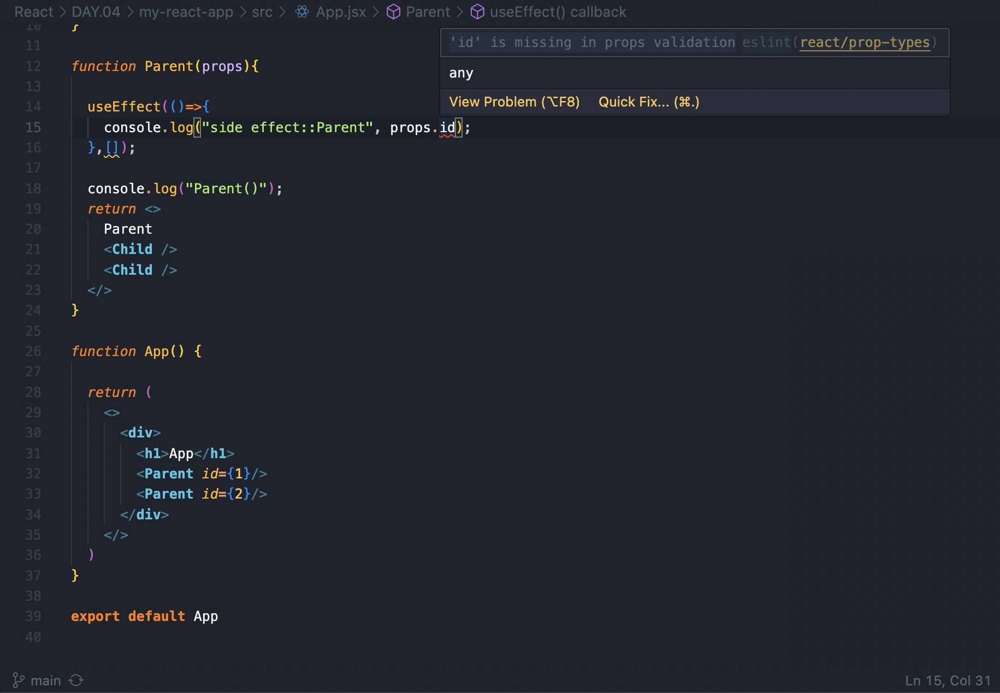
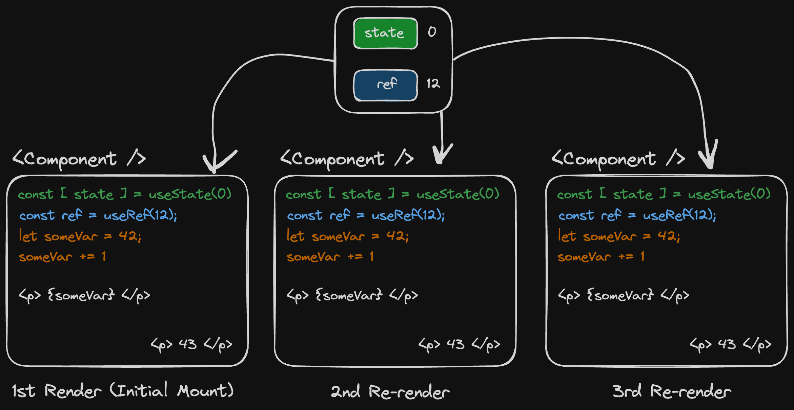
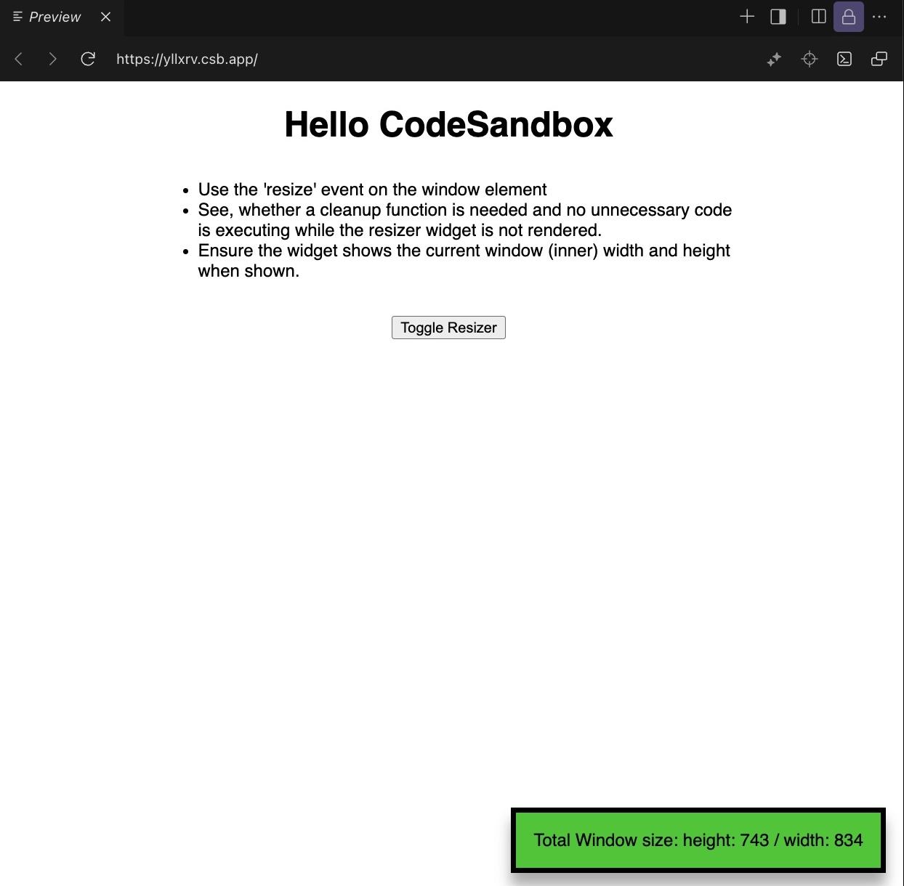

# Day 06

  **Topics:**

  

  - [`PropTypes`](https://www.npmjs.com/package/prop-types): "You can use `prop-types` to document the intended types of properties passed to React components. React will check props passed to your components against those definitions, and warn in development if they don’t match."
    - [Lecture code](./assets/App.PropType.jsx)

  

  - `useRef`
    - `useRef` vs `useState` vs normal variables 
    - [Lecture code](./assets/App.useRef.jsx)

## Practice and Coding challenges

  **The Resizer Widget** Challenge:

  

  - Complete the `Resizer Widget` as described during the lecture.
    - Requirements:
      - Use the [`resize`](https://developer.mozilla.org/en-US/docs/Web/API/Window/resize_event) event on the window element.
      - See, whether a `cleanup` function is needed and no unnecessary code is executing while the resizer widget is not rendered.
      - Ensure the widget shows the current window (inner) width and height when shown.

  **The WhatsApp Refactoring** Challenge:

  - Transform the HTML/CSS/JS `WhatsApp` into a React app.
    - [Original code](./assets/whatsapp-in-pure-css-and-js.zip)

## Reference & Resources

  - [ESLint](https://eslint.org/)
    - "ESLint statically* analyzes your code to quickly find problems. It is built into most text editors". (*statically, without the need to run the code.)
    - [ESLint - Getting Started](https://eslint.org/docs/latest/use/getting-started)

  - Install: [ESLint VSCode Extension](https://marketplace.visualstudio.com/items?itemName=dbaeumer.vscode-eslint)

