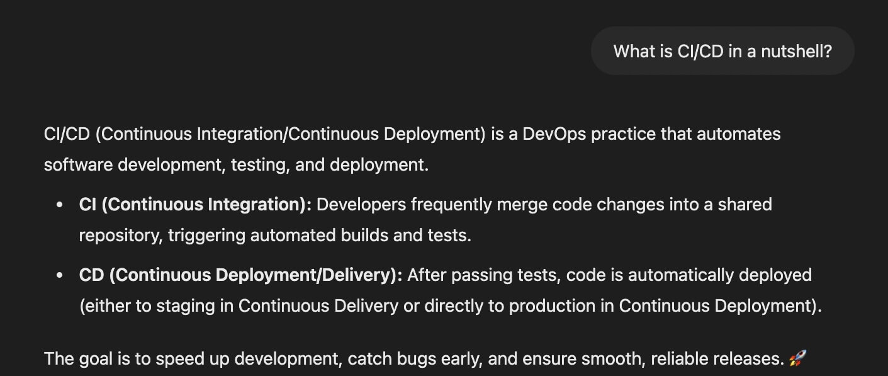
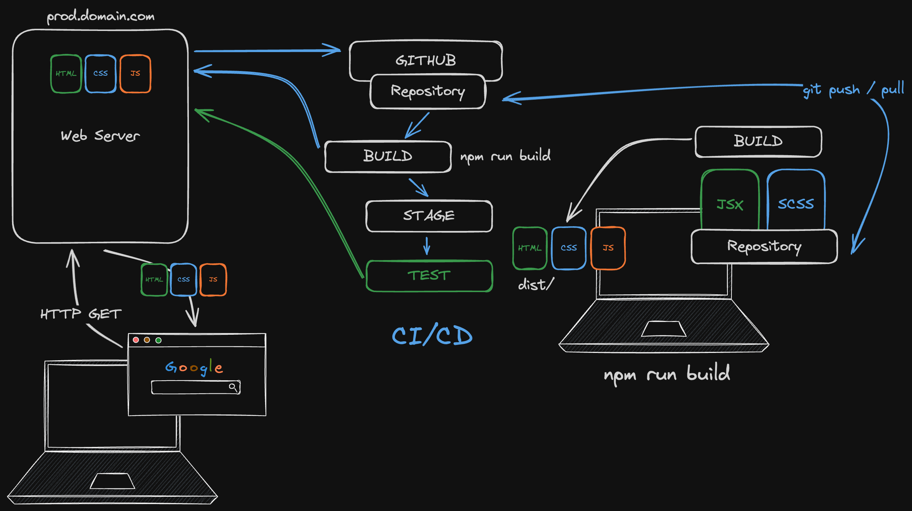
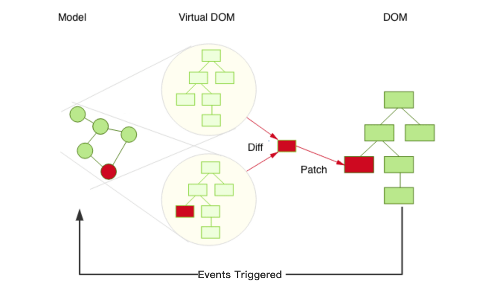

# Day 08

  **Topics:**

  - Building and deploying web apps.

  

  

  - React's VirtualDOM, the [Reconciliation process](./assets/Reconciliation.mp4) and smart DOM updates

  

  - How the double rendering of `<StrictMode>` catches (re-rendering) bugs early

  - Using `useRef` with the [Typed.js library](https://github.com/mattboldt/typed.js).
    - Make sure to `npm install typed.js`

  - The `npm run build` process and other `npm` scripts provided by `vite`.

  - Skipping the initial call of useEffect using `useRef`.
    - References: [StackOverflow](https://stackoverflow.com/questions/53179075/with-useeffect-how-can-i-skip-applying-an-effect-upon-the-initial-render)

  Lecture code can be found [here](./assets/App.jsx)

## Practice

  - Try to understand when a component gets unmounted and log a Good bye message to the console. Also, console.log when a Component gets remounted 
  and make sure to distinguish between re-renders of one Component instance 
  vs newly created instances (component unmounts and remounts again).

## Reading

  - [Fixing bugs found by double rendering in development](https://react.dev/reference/react/StrictMode#fixing-bugs-found-by-double-rendering-in-development)

## Extra Resources & References

  - [How To Deploy A React Vite App To Github Pages](https://www.youtube.com/watch?v=hn1IkJk24ow)

  - [How to run ESLint using a pre-commit hook](https://levelup.gitconnected.com/how-to-run-eslint-using-pre-commit-hook-25984fbce17e)