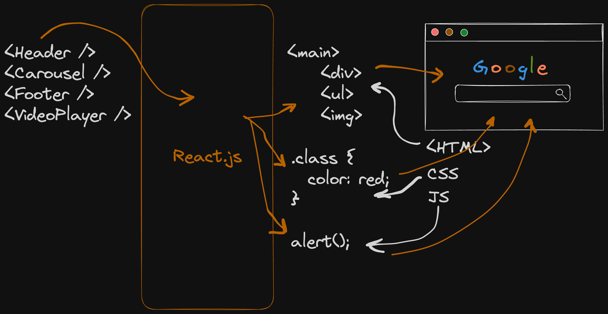

# Exploring React.js

> React: The library for web and native user interfaces

## Prerequisites

  - [ ] [`try/catch/finally`](https://developer.mozilla.org/en-US/docs/Web/JavaScript/Reference/Statements/try...catch)

## Day 01: Intro to the React Philosophy of Components

  **Agenda**

  - What is React?
  - What is the philosophy of React?
  - How to think about Components
  - React Hello World

  

  **Tasks**

  - [ ] Create a personal/professional GitHub account
  - [ ] Fork GitHub Repository: [React-Journey](https://github.com/in-tech-gration/React-Journey)
  - [ ] Install [Live Server VSCode Extension](https://marketplace.visualstudio.com/items?itemName=ritwickdey.LiveServer)

  **Study & Practice** 
  
  > Use the Hints and/or Solutions only as a last resort!

  The simplest way to start experimenting with React, is by downloading the [HTML page](https://gist.githubusercontent.com/gaearon/0275b1e1518599bbeafcde4722e79ed1/raw/db72dcbf3384ee1708c4a07d3be79860db04bff0/example.html) example found in the [Try React locally](https://react.dev/learn/installation#try-react-locally) section of the documentation and running it locally using [Live Server](https://marketplace.visualstudio.com/items?itemName=ritwickdey.LiveServer).

  - [ ] [Your First Component](https://react.dev/learn/your-first-component)
  - [ ] [Importing and Exporting Components](https://react.dev/learn/importing-and-exporting-components)
  - [ ] [Writing Markup with JSX](https://react.dev/learn/writing-markup-with-jsx)
  - [ ] [JavaScript in JSX with Curly Braces](https://react.dev/learn/javascript-in-jsx-with-curly-braces)

  **Exercises**

  Most of the chapters from the documentation above contain small exercises that will give you the chance to practice on the concepts. You can also practice on the exercises below:

  - **Cookie Notice exercise**: 
    - Inside the `DAY.01` folder, you'll find a folder named `exercises` which contains a static HTML file (`cookie-practice-original.html`) which contains a simple Cookie notice widget. Your task is to use the React quickstart HTML found [here](https://gist.githubusercontent.com/gaearon/0275b1e1518599bbeafcde4722e79ed1/raw/db72dcbf3384ee1708c4a07d3be79860db04bff0/example.html) and convert the Cookie notice widget into a React Component.

  **Resources**

  - [The Official React Documentation](https://react.dev/)
  - Check the [assets folder](./DAY.01/assets/) for this lesson.

---

## Day 02

  - [ ] Install Browser Extension: [React DevTools](https://react.dev/learn/react-developer-tools#browser-extension)

  **Study & Practice** 
  
  > Use the Hints and/or Solutions only as a last resort!

  - [Passing Props to a Component](https://react.dev/learn/passing-props-to-a-component)
  - [Conditional Rendering](https://react.dev/learn/conditional-rendering)
  - [Rendering Lists](https://react.dev/learn/rendering-lists)
  - Start building your personal portfolio website using React
    - [ ] Create a new (official) repository
  - [ ] The `<YouTube>` Component challenge.
    - [ ] Start by copying the [/DAY.02/exercises/youtube-original.html](./DAY.02/exercises/youtube-original.html) file. Rename to `/DAY.02/exercises/youtube.html` and start hacking! 

  **Resources** 

  - Live session code:
    - Props: [/DAY.02/assets/live-session-14.12.2024-props.html](./DAY.02/assets/live-session-14.12.2024-props.html)

---

## Day 03

  **Study & Practice**

  - Create a React Project with vite:
    - [ ] `npm create vite@latest my-react-app -- --template react`
    - [ ] `cd my-react-app` _(you can use any name for your app folder)_
    - [ ] `npm install` (one-time) 
    - [ ] `npm run dev` (run every time you want to develop)
    - [ ] https://vite.dev/guide/#scaffolding-your-first-vite-project

  - Other ways to start a new React project
    - https://react.dev/learn/start-a-new-react-project

  - [What is <StrictMode/>?](https://react.dev/reference/react/StrictMode)
  - [Creating an Element without JSX](https://react.dev/reference/react/createElement#creating-an-element-without-jsx)

  - More material for study and practice coming soon...

---

## Day 04

  - Topics: `useEffect` and `React Component Lifecycle`
    - See [README](./DAY.04/README.md)

---

## Day 05

---

## Day 06

  - Topics: `PropTypes` and `useRef`
    - See [README](./DAY.06/README.md)

---

## Day 07

  - Topics: `useRef` (Part 2)
    - See [README](./DAY.07/README.md)

    ---

## Day 08

  - See [README](./DAY.08/README.md)
