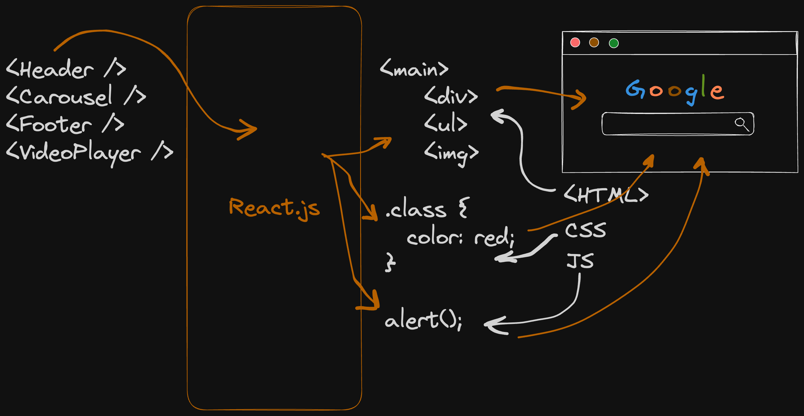

# Exploring React.js

> React: The library for web and native user interfaces

## Prerequisites

  - [ ] [`try/catch/finally`](https://developer.mozilla.org/en-US/docs/Web/JavaScript/Reference/Statements/try...catch)

## Day 01: Intro to the React Philosophy of Components

  **Agenda**

  - What is React?
  - What is the philosophy of React?
  - How to think about Components
  - React Hello World

  

  **Tasks**

  - [x] Create a personal/professional GitHub account
  - [x] Fork GitHub Repository: [React-Journey](https://github.com/in-tech-gration/React-Journey)
  - [x] Install [Live Server VSCode Extension](https://marketplace.visualstudio.com/items?itemName=ritwickdey.LiveServer)

  **Study & Practice** 
  
  > Use the Hints and/or Solutions only as a last resort!

  The simplest way to start experimenting with React, is by downloading the [HTML page](https://gist.githubusercontent.com/gaearon/0275b1e1518599bbeafcde4722e79ed1/raw/db72dcbf3384ee1708c4a07d3be79860db04bff0/example.html) example found in the [Try React locally](https://react.dev/learn/installation#try-react-locally) section of the documentation and running it locally using [Live Server](https://marketplace.visualstudio.com/items?itemName=ritwickdey.LiveServer).

  - [x] [Your First Component](https://react.dev/learn/your-first-component)
  - [x] [Importing and Exporting Components](https://react.dev/learn/importing-and-exporting-components)
  - [x] [Writing Markup with JSX](https://react.dev/learn/writing-markup-with-jsx)
  - [x] [JavaScript in JSX with Curly Braces](https://react.dev/learn/javascript-in-jsx-with-curly-braces)

  **Exercises**

  Most of the chapters from the documentation above contain small exercises that will give you the chance to practice on the concepts. You can also practice on the exercises below:

  - [x] **Cookie Notice exercise**: 

    - Inside the `DAY.01` folder, you'll find a folder named `exercises` which contains a static HTML file (`cookie-practice-original.html`) which contains a simple Cookie notice widget. Your task is to use the React quickstart HTML found [here](https://gist.githubusercontent.com/gaearon/0275b1e1518599bbeafcde4722e79ed1/raw/db72dcbf3384ee1708c4a07d3be79860db04bff0/example.html) and convert the Cookie notice widget into a React Component.

  **Resources**

  - [The Official React Documentation](https://react.dev/)
  - Check the [assets folder](./DAY.01/assets/) for this lesson.

---

## Day 02

  - [ ] Install Browser Extension: [React DevTools](https://react.dev/learn/react-developer-tools#browser-extension)

  **Study & Practice** 
  
  > Use the Hints and/or Solutions only as a last resort!

  - [ ] [Passing Props to a Component](https://react.dev/learn/passing-props-to-a-component)
  - [ ] [Conditional Rendering](https://react.dev/learn/conditional-rendering)
  - [ ] [Rendering Lists](https://react.dev/learn/rendering-lists)
  - [ ] Start building your personal portfolio website using React
    - [ ] Create a new (official) repository
  - [ ] The `<YouTube>` Component challenge.

---

## Day 03

---

## Day 04